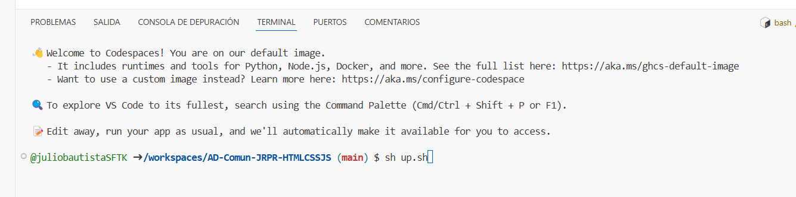

### Este codespace tiene un shell que levanta un servidor para la bse de datos.

Una vez abierto el codespaces, teclea sh up.sh y da enter.

Deberias ver una imagen como la siguiente:

 

Una vez terminado el shell se habrán creado una base de datos con 2 tablas pobladas.

Para acceder a la base de datos usa estas instrucciones

docker exec -it ad-comun-jrpr-sql-mysql-1 /bin/bash

mysql -h localhost -u user -ppassword
use DB_EjercicioComunJRPR;
show tables;

