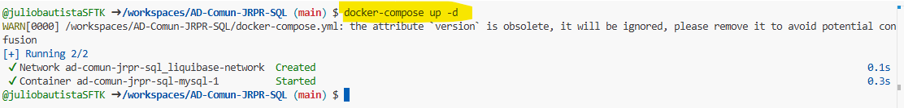

### Este codespace tiene un shell que levanta un servidor para la base de datos.

1.-Una vez abierto el codespaces, teclea docker-compose up -d 

 

espera 2 minutos para que el contenedor de base de datos levante y teclea sh up.sh, da enter.

2.-Deberías ver una imagen como la siguiente:

 

3.-Una vez terminado el shell se habrán creado una base de datos con 2 tablas pobladas.

Para acceder a la base de datos usa estas instrucciones

docker exec -it ad-comun-jrpr-sql-mysql-1 /bin/bash

 

4.-Una vez dentro escribe: mysql -h localhost -u user -ppassword

Estarás dentro la base de datos.

 

5.-Escribe las siguientes instrucciones:

use DB_EjercicioComunJRPR;

show tables;

 

6.-Aquí ya puedes ejecutar tus scripts.
